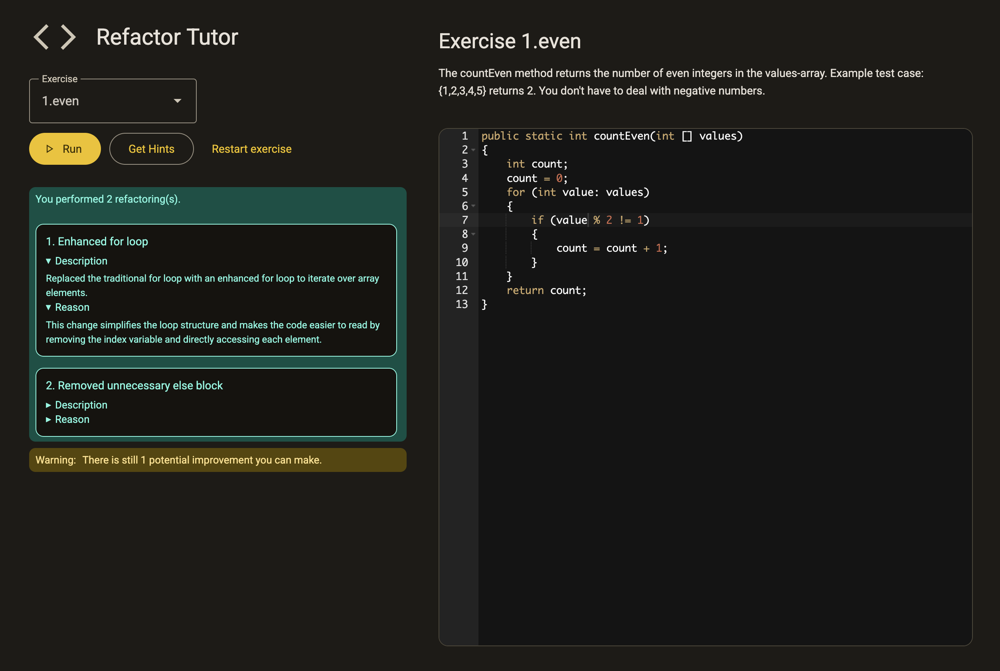
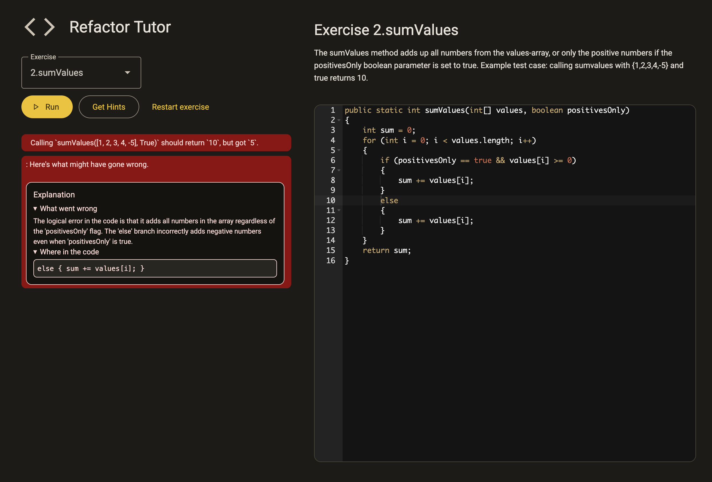

# LLM-RPT — Refactoring Tutor

A minimal project for an **LLM-powered Refactoring Tutor**.  

---

## Screenshots

### 1) Multi-step hint system
Helps users discover improvements step by step.


### 2) Transformation detection
Automatically detects correct refactorings performed by the user.



### 3) Functional change warnings
Explains why changes in functionality might occur when refactoring.



---

## Prerequisites

- **Python** ≥ 3.10
- **Node.js** ≥ 18 and **npm**
- **OpenAI API Key** Set as env var `OPENAI_API_KEY`

---

## Setup

### 1) Backend
#### Install Packages
```bash
# in repo root
pip install -r requirements.txt
```
#### Add OpenAI API key 
```bash
# export api key
export OPENAI_API_KEY=<your_key_here>
```
or create .env file with your key.

### 2) Frontend
```bash
cd vite-frontend
npm install
cd ..
```

## How to Run
Run full project locally:
```bash
make all
```


